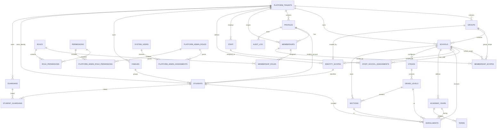

# ERD Core v1 — School Management System

**التاريخ:** 2026-09-22  
**الحالة:** Logical ERD / Foundation — جاهز للمراجعة قبل SQL migrations  
**مرجع المتطلبات:** `PLAN_v3.md` / قرارات 2026-09-21 و2026-09-22

---

## 1. الهدف والنطاق

هذا الملف يثبت **النموذج المنطقي الأساسي** الذي يجب ألا يتغير أثناء تنفيذ Foundation إلا بقرار معماري صريح.

النطاق الحالي:

- Platform Tenant / Group / School
- Platform Admin identity boundary
- Tenant profiles
- Membership / Role / Permission / Scope
- Staff identity and school assignments
- Family / Student / Guardian identity
- Student Identity Scope (Group أو مدرسة مستقلة)
- Academic Year / Term / Grade / Section
- Enrollment
- Audit
- RLS ownership model

خارج النطاق التفصيلي هنا: Finance، Timetable، Grading internals، OCR، Payroll؛ لكنها يجب أن تتبع نفس قواعد الملكية والعزل.

---

## 2. قاعدة الملكية

| المستوى | أمثلة | قاعدة الوصول |
|---|---|---|
| Platform Tenant | `platform_tenants`, `profiles`, `roles` المخصصة | Tenant isolation |
| Group | `groups`, بعض قوالب/إعدادات المجموعة | Tenant + Group scope |
| School | `schools`, `academic_years`, `sections`, `enrollments`, attendance | Tenant + Group/School scope |
| Identity within Group/Tenant | `students`, `families`, `guardians` | Tenant + العلاقة/النطاق المصرح به |
| System Operator | Platform Admin | منفصل عن Tenant membership |

**قاعدة إلزامية:** أي جدول جديد يجب أن يعلن في Data Dictionary عن مستوى ملكيته قبل إنشاء migration.

---

## 3. ERD المنطقي



> Mermaid يعرض العلاقات الأساسية فقط؛ القيود الجزئية والـindexes والـRLS لا تظهر كلها في الرسم.

---

## 4. الجداول الأساسية

### 4.1 `platform_tenants`

**الملكية:** System / Platform root

| العمود | النوع | القاعدة |
|---|---|---|
| `id` | uuid | PK |
| `tenant_code` | text | UNIQUE على مستوى المنصة، ثابت وغير معاد الاستخدام |
| `name` | text | NOT NULL |
| `status` | enum/text | `active`, `suspended` |
| `created_at` | timestamptz | NOT NULL |
| `updated_at` | timestamptz | NOT NULL |

لا يؤدي `suspended` إلى حذف البيانات؛ يمنع العمليات المسموح منعها ويتيح إعادة التفعيل.

### 4.2 `groups`

**الملكية:** Platform Tenant

| العمود | النوع | القاعدة |
|---|---|---|
| `id` | uuid | PK |
| `platform_tenant_id` | uuid | FK → `platform_tenants.id`, NOT NULL |
| `group_code` | text | UNIQUE ضمن Tenant |
| `name` | text | NOT NULL |
| `status` | enum/text | active/inactive |
| `created_at` | timestamptz | NOT NULL |
| `updated_at` | timestamptz | NOT NULL |

### 4.3 `schools`

**الملكية:** Platform Tenant

| العمود | النوع | القاعدة |
|---|---|---|
| `id` | uuid | PK |
| `platform_tenant_id` | uuid | FK, NOT NULL |
| `group_id` | uuid | FK → groups.id, NULLABLE |
| `school_code` | text | UNIQUE ضمن Tenant، ثابت وغير معاد الاستخدام |
| `name` | text | NOT NULL؛ ليس Unique عالمياً |
| `status` | enum/text | active/archived |
| `slug` | text | سياق subdomain؛ uniqueness ضمن Tenant |
| `created_at` | timestamptz | NOT NULL |
| `updated_at` | timestamptz | NOT NULL |
| `archived_at` | timestamptz | NULLABLE |

**Constraint مهم:** `schools.group_id` إن وجد يجب أن يشير إلى Group من نفس `platform_tenant_id`.

### 4.4 `system_users` و`platform_admin_assignments`

Platform Admin ليس Tenant member.

`system_users`:

- `id` uuid PK
- `auth_user_id` uuid UNIQUE → `auth.users.id`
- `display_name`
- `status`
- timestamps

`platform_admin_roles`:

- `id`
- `code` مثل `platform_admin`
- `name`

`platform_admin_assignments`:

- `system_user_id` FK
- `platform_admin_role_id` FK
- status/timestamps

`platform_admin_role_permissions` (قرار C3 — 2026-09-22):

- `platform_admin_role_id` FK
- `permission_id` FK → `permissions` — **نفس كتالوج صلاحيات الـTenant**
- PK `(platform_admin_role_id, permission_id)`

```text
Platform Admin → Role → Permission + Platform-level scope
```

`app.is_platform_admin()` اختبار هوية فقط ولا يمنح أي صلاحية؛ الوصول يتطلب الـPermission. هذا يمنع النمط `is_platform_admin = true → full access`.

هذا يمنع تمثيل Platform Admin كـ`profiles` داخل Tenant بالخطأ.

### 4.5 `profiles`

**الملكية:** Platform Tenant

- `id` uuid PK
- `platform_tenant_id` FK NOT NULL
- `auth_user_id` FK → `auth.users.id`, NOT NULL, **UNIQUE عالمياً**
- `display_name`
- `status`
- `created_at`, `updated_at`

**Constraint (قرار O1 — 2026-09-22):** `auth_user_id` **UNIQUE على مستوى المنصة**، لا داخل Tenant فقط.

```text
auth_user_id
    ↓ UNIQUE
exactly one profile
    ↓
exactly one platform_tenant
```

`(platform_tenant_id, auth_user_id)` UNIQUE يبقى كفهرس مركّب للأداء وللتعبير الصريح عن النية، لكنه **ليس** القيد الحاكم.

**لماذا لا يكفي القيد المركّب:** هو يسمح فعلياً بوجود profile لنفس Auth user في Tenantين، وهو ما كانت الصياغة السابقة تمنعه "عملياً" فقط — أي بلا قيد. وبوجود profileين تصبح `app.current_tenant_id()` **غير حتمية** (تُرجع أكثر من صف)، فينهار Tenant Isolation من جذره. الشخص العامل في Tenantين يحتاج **حسابي دخول منفصلين**.

### 4.6 `memberships`

تمثيل العلاقة الأساسية للمستخدم داخل Tenant. لا نربط الدور أو المدرسة مباشرة داخل الصف نفسه حتى ندعم تعدد الأدوار والنطاقات بشكل طبيعي.

- `id` uuid PK
- `platform_tenant_id` FK NOT NULL
- `profile_id` FK NOT NULL
- `status` active/suspended/ended
- `created_at`, `updated_at`

**Constraint:** `(platform_tenant_id, profile_id)` UNIQUE.

### 4.7 `roles`

- `id` uuid PK
- `platform_tenant_id` FK NULLABLE
- `code`
- `name`
- `is_system` boolean
- `status`

`platform_tenant_id IS NULL` = role system/template.  
`platform_tenant_id IS NOT NULL` = custom tenant role.

**Constraint:** custom role code unique within Tenant.

### 4.8 `permissions`

Permission catalog عالمي داخل التطبيق:

- `id` uuid PK
- `code` UNIQUE، مثال: `student.read`, `student.create`, `student.update`, `student.export`
- `description`
- `resource`
- `operation`
- `is_sensitive`

لا تنشئ المدرسة Permission جديداً؛ المدرسة تنشئ Role وتربطه بالـcatalog.

### 4.9 `role_permissions`

- `role_id`
- `permission_id`
- PK `(role_id, permission_id)`

### 4.10 `membership_roles`

يدعم عدة أدوار لنفس العضوية:

- `membership_id`
- `role_id`
- PK `(membership_id, role_id)`

### 4.11 `membership_scopes`

النطاق منفصل عن الدور.

| العمود | النوع | القاعدة |
|---|---|---|
| `id` | uuid | PK |
| `membership_id` | uuid | FK NOT NULL |
| `scope_type` | enum | `tenant`, `group`, `school` |
| `group_id` | uuid | مطلوب فقط لـgroup scope |
| `school_id` | uuid | مطلوب فقط لـschool scope |
| `created_at` | timestamptz | NOT NULL |

**قواعد:**

- `tenant`: كلا `group_id` و`school_id` = NULL.
- `group`: `group_id` NOT NULL و`school_id` = NULL.
- `school`: `school_id` NOT NULL و`group_id` = NULL.
- الـreferenced object يجب أن ينتمي إلى نفس Tenant الخاص بالـmembership.
- يمكن وجود عدة `school` scope rows لتمثيل عدة مدارس.
- Scope لا يمنح Permission؛ هو يحدد أين يمكن استعمال الـPermission.

### 4.12 `staff`

**الملكية:** Platform Tenant

- `id` uuid PK
- `platform_tenant_id` FK NOT NULL
- `profile_id` FK NULLABLE/حسب سياسة إنشاء حساب الموظف
- `employee_code` UNIQUE ضمن Tenant
- الاسم والبيانات الوظيفية
- `status`, `archived_at`

### 4.13 `staff_school_assignments`

- `id`
- `staff_id`
- `school_id`
- `job_title`
- `status`
- `effective_from`, `effective_to`

وجود Staff في Tenant لا يعني أنه يرى كل مدارس Tenant؛ المدرسة التشغيلية تحدد عبر assignment + authorization scope.

### 4.14 `families`

**الملكية:** Platform Tenant

- `id`
- `platform_tenant_id`
- `family_code` اختياري
- بيانات الأسرة الأساسية
- status/timestamps

### 4.15 `students`

**الملكية:** Tenant identity؛ والهوية التشغيلية تثبت على مستوى Group عند وجود Group.

- `id` uuid PK — Student UUID ثابت داخل Group
- `platform_tenant_id` FK NOT NULL
- `identity_scope_id` FK → `identity_scopes.id`, **NOT NULL** (قرار A4)
- `student_profile_id` FK → `profiles.id`, **NOT NULL UNIQUE** — حساب الطالب، 1:1 (قرار N1)
- `family_id` FK NULLABLE
- `official_id` NULLABLE
- `temporary_id` NULLABLE
- بيانات الشخص الأساسية
- `status`, `archived_at`

**مهم:** لا يوجد `school_id` هنا.

**حساب الطالب (قرار N1 — 2026-09-22):**

```text
Student
   ↓ 1:1
Student Account / Profile
```

`student_profile_id` UNIQUE يفرض 1:1 — حساب واحد لا يمثل طالبَين، وطالب واحد لا يملك حسابين.

**قيد سلامة Tenant:** `profile.platform_tenant_id = student.platform_tenant_id`، ويُفرض بـFK مركّب `(student_profile_id, platform_tenant_id) → profiles (id, platform_tenant_id)` لا بـtrigger.

بدون هذا العمود لا يمكن تنفيذ حساب الطالب المقرَّر في `PLAN_v3.md` §7.19، ولا كتابة `app.student_is_self()` في نموذج RLS.

**هوية Official ID — قرار A4 (2026-09-22):**

نطاق الهوية كيان صريح لا فرع `NULL`:

```text
Student Identity Scope
   ├── Group                (مدرسة أو أكثر داخل مجموعة)
   └── Standalone School    (مدرسة بلا مجموعة)
```

- `(identity_scope_id, official_id)` UNIQUE عندما `official_id IS NOT NULL` — **قيد إعلاني واحد يغطي الحالتين**.
- `students` تبقى **بلا `school_id`**؛ نطاق الهوية ليس المدرسة التشغيلية.
- الصيغة السابقة (التفرد للمدرسة المستقلة عبر `enrollments`) أُلغيت: كانت تعبر جدولين، غير إعلانية، معرَّضة لـrace condition، ولا تعمل قبل أول enrollment.
- `students.group_id` **حُذف** — مشتق من `identity_scopes`، وإبقاؤه يخلق مصدرَي حقيقة بلا قيد يزامنهما.
- `temporary_id` يولده النظام ولا يدخله المستخدم يدوياً.

### 4.15a `identity_scopes` (قرار A4)

**الملكية:** Platform Tenant

- `id` uuid PK
- `platform_tenant_id` FK NOT NULL
- `scope_kind`: `group` | `school`
- `group_id` FK — لنطاق المجموعة فقط
- `school_id` FK — للمدرسة المستقلة فقط

**القيود:**

- نطاق واحد لكل Group، وواحد لكل مدرسة مستقلة.
- مدرسة داخل Group **لا تملك** نطاقاً خاصاً — مفروض بعمود `schools.is_standalone` المشتق + FK مركّب.
- يُنشأ تلقائياً مع المجموعة ومع المدرسة المستقلة.

التفاصيل الكاملة: `docs/DATA_DICTIONARY_v1.md` §2.16.1.

### 4.16 `enrollments`

**الملكية:** School

- `id` uuid PK
- `school_id` FK NOT NULL
- `student_id` FK NOT NULL
- `academic_year_id` FK NOT NULL
- `grade_level_id` FK NOT NULL
- `section_id` FK NOT NULL
- `status` active/withdrawn/transferred/etc.
- `effective_from`, `effective_to`
- `created_by`, `created_at`, `updated_at`

**Constraint:** لا أكثر من Enrollment active لنفس `student + school + academic_year`.

الانتقال بين الشعب داخل السنة لا يمحو enrollment القديم؛ يتم حفظ الفترة/السجل التاريخي وإنشاء سجل الانتقال حسب نموذج النقل.

### 4.17 `guardians`

**الملكية:** Platform Tenant

- `id`
- `platform_tenant_id`
- `profile_id`
- `phone_e164` UNIQUE داخل Tenant
- بيانات الاسم
- status/security fields

الحساب الواحد يمكن ربطه بعدة طلاب ومدارس داخل نفس Tenant.

### 4.18 `student_guardians`

Many-to-Many:

- `student_id`
- `guardian_id`
- `relationship_type`
- `is_primary`
- notification preferences
- status/effective dates

**Constraint:** الطالب والـguardian يجب أن يكونا داخل نفس Platform Tenant.

### 4.19 Academic Foundation

`academic_years`:

- `id`
- `school_id` NOT NULL
- `name`
- `start_date`, `end_date`
- `status`: planned/active/closed

**Constraint:** سنة واحدة active لكل School، ولا يوجد overlap غير مسموح به.

`terms`:

- `id`
- `academic_year_id`
- `name`
- `sequence_no`
- `start_date`, `end_date`

`stages`:

- `id`
- `school_id`
- `name`
- `sequence_no`

`grade_levels`:

- `id`
- `school_id`
- `stage_id`
- `name`
- `sequence_no`

`sections`:

- `id`
- `school_id`
- `academic_year_id`
- `grade_level_id`
- `name`
- `capacity`
- `gender_policy`
- status

**قاعدة:** section name ليس Unique عالمياً؛ uniqueness يكون داخل سياق المدرسة/السنة/الصف وفق الحاجة.

### 4.20 `audit_log`

**الملكية:** System audit stream، مع tenant/school scope داخل السجل.

الحقول الأساسية:

- `id`
- `platform_tenant_id`
- `school_id` NULLABLE حسب entity ownership
- `actor_type` (`tenant_user`, `platform_admin`, `system`)
- `actor_id`
- `action`
- `entity_type`
- `entity_id`
- `old_values` jsonb NULLABLE
- `new_values` jsonb NULLABLE
- `reason` NULLABLE
- `source` (`web`, `mobile`, `api`, `system`)
- `created_at`

**لا يسمح للتطبيق بحذف audit rows أو تعديلها.**

---

## 5. أهم القيود Integrity Constraints

1. كل `school` و`group` و`profile` مرتبط بـTenant واحد فقط.
2. `schools.group_id` لا يمكن أن يشير إلى Group من Tenant آخر.
3. `profiles` لا تتجاوز Tenant واحداً.
4. `memberships.profile_id` و`membership_scopes` لا تتجاوز Tenant العضوية.
5. لا يوجد Platform Admin عبر `profiles`.
6. `employee_code` unique داخل Tenant فقط.
7. `school_code` unique داخل Tenant فقط وغير معاد الاستخدام.
8. `group_code` unique داخل Tenant فقط وغير معاد الاستخدام.
9. Student duplicate prevention: `(identity_scope_id, official_id)` UNIQUE — official ID لا يمثل Student UUIDين داخل نفس نطاق الهوية.
10. Student يحتفظ بنفس UUID عند النقل داخل نطاق هويته؛ النقل خارجه ينشئ سجلاً جديداً.
10b. نطاق هوية واحد لكل Group، وواحد لكل مدرسة مستقلة؛ **مدرسة داخل Group لا تملك نطاقاً خاصاً** (مفروض بـFK مركّب على `is_standalone`).
11. Enrollment active uniqueness: طالب + مدرسة + سنة = Enrollment نشط واحد.
12. Academic year active uniqueness: مدرسة = سنة نشطة واحدة.
13. Term لا يتجاوز حدود academic year.
14. Section belongs to same school/year/grade context.
15. Guardian phone unique داخل Tenant.
16. Receipt/payment/external transaction uniqueness يطبق في Finance ERD، وليس هنا.
17. `profiles.auth_user_id` UNIQUE **عالمياً** — لا profile لنفس Auth user في Tenantين (O1).
18. `students.student_profile_id` UNIQUE — علاقة 1:1 بين الطالب وحسابه (N1).
19. **Authorization integrity — إسناد الأدوار (N2):** لا يجوز إسناد Role يحمل Permissions لا يملكها المُسنِد.

```text
membership_roles
       ↓
T8
       ↓
actor_permissions ⊇ target_role_permissions
```

هذا **integrity constraint وليس RLS policy**. RLS تحكم أي صف يُكتب، ولا تستطيع مقارنة مجموعتَي صلاحيات — فالفحص يتطلب استعلاماً مجمَّعاً على `role_permissions`. يُنفَّذ كـtrigger على `membership_roles`.

**الحالة التي يجب أن تُرفض:**

```text
School Admin يملك: role.assign
يحاول:            إسناد tenant_admin
النتيجة:          رفض — حتى لو سمحت له RLS بالكتابة على الصف
```

بدونه يستطيع أي حامل لـ`role.assign` أن يسند لنفسه دوراً أعلى — **تصعيد صلاحية كامل**. تغطية pgTAP إلزامية.

---

## 6. Authorization Model

### 6.1 القرار

```text
Effective Access = Membership
                  + Role(s)
                  + Permission(s)
                  + Scope(s)
                  + Resource relationship
```

مثال:

```text
teacher membership
  -> role: teacher
  -> permissions: student.read, grade.enter
  -> scope: school A
  -> resource filter: only assigned sections/subjects
```

المعلم لا يحصل على كل طلاب المدرسة لمجرد أن لديه `student.read`؛ العلاقة التشغيلية `teaching_assignments` تضيق النطاق.

### 6.2 Export

`student.read` لا يعني `student.export`.

يجب تعريف Permissions مستقلة مثل:

- `student.read`
- `student.create`
- `student.update`
- `student.archive`
- `student.export`
- `student.sensitive_read`

والنمط نفسه للمالية والدرجات والحضور والتقارير.

---

## 7. RLS Model

### 7.1 Helpers المقترحة

```sql
app.current_profile_id()
app.current_tenant_id()
app.is_platform_admin()
app.has_permission(permission_code text)
app.can_access_tenant(tenant_id uuid)
app.can_access_group(group_id uuid)
app.can_access_school(school_id uuid)
```

كل helper حساس يفضل أن يكون `SECURITY DEFINER`, `STABLE`, مع `SET search_path` إلى schema ثابت، وألا يعتمد على جدول يعيد استدعاء policy نفسه بطريقة recursive.

### 7.2 School-level table

الفكرة المنطقية:

```sql
using (
  app.can_access_school(school_id)
  and app.has_permission('resource.read')
)
```

وعند الكتابة:

```sql
with check (
  app.can_access_school(school_id)
  and app.has_permission('resource.create')
)
```

### 7.3 Group-level table

```sql
using (
  app.can_access_group(group_id)
  and app.has_permission('resource.read')
)
```

### 7.4 Tenant-level table

```sql
using (
  app.can_access_tenant(platform_tenant_id)
  and app.has_permission('resource.read')
)
```

### 7.5 Student identity table

لا نعتمد على `students.school_id` لأنه غير موجود.

القراءة تكون منطقياً:

```text
Tenant isolation
AND
user has permission student.read
AND
there exists an enrollment for the student
    whose school is inside the user's effective scope
```

وبالنسبة لولي الأمر:

```text
Tenant isolation
AND
student is linked through student_guardians to current guardian
```

وبالنسبة للمعلم:

```text
Tenant isolation
AND
student has active enrollment in an accessible school
AND
student's enrollment section/subject is inside teaching assignment
```

### 7.6 Platform Admin

لا تمنحه RLS وصولاً شاملاً تلقائياً.

- Platform admin العام: يدير metadata والـtenancy وفق صلاحياته.
- قراءة بيانات الطلاب/الدرجات/المالية الحساسة: Permission صريحة + audit.
- لا تستخدم `service_role` كبديل لصلاحية المستخدم في عمليات الإدارة العادية.

---

## 8. Indexing Baseline

يجب توفير indexes على الأقل لـ:

- جميع FKs الرئيسية.
- `schools(platform_tenant_id, group_id)`.
- `profiles(platform_tenant_id, auth_user_id)`.
- `memberships(platform_tenant_id, profile_id)`.
- `membership_scopes(membership_id, scope_type)`.
- `staff(platform_tenant_id, employee_code)`.
- `students(identity_scope_id, official_id)` مع partial uniqueness عندما `official_id IS NOT NULL`.
- `students(student_profile_id)` لمسار حساب الطالب.
- `enrollments(school_id, academic_year_id, student_id)`.
- `enrollments(school_id, academic_year_id, section_id)`.
- `student_guardians(guardian_id, student_id)`.
- `academic_years(school_id, status)`.
- `audit_log(platform_tenant_id, created_at)` و`audit_log(entity_type, entity_id)`.

لا نضيف indexes عشوائية؛ بعد Foundation يمكن قياس الاستعلامات وإضافة indexes مدفوعة بالأداء.

---

## 9. ما لن نفعله في Foundation

- لا نضع `school_id` على كل جدول بلا تمييز.
- لا نربط الدور مباشرة بالـJWT كحقيقة نهائية.
- لا نعتمد على إخفاء الأزرار في React.
- لا نستخدم `service_role` من المتصفح.
- لا نسمح لـPlatform Admin بقراءة كل البيانات تلقائياً.
- لا نحذف Student/Staff/Guardian hard delete.
- لا نعدل migration منفذة.
- لا نعطل RLS مؤقتاً لإنهاء feature.
- لا نثبت عدد الفصول الدراسية أو المراحل أو الشعب في الكود.

---

## 10. ترتيب التنفيذ بعد اعتماد ERD

> **مُستبدَل (Gate B، 2026-09-23):** الترتيب التنفيذي النهائي ومخطط الاعتماديات في `docs/DB_IMPLEMENTATION_SPEC_v1.md` §B9 و§B10. القائمة أدناه تاريخية.

1. Data Dictionary نهائي لكل جدول Foundation.
2. Authorization Matrix: Roles × Permissions × Scopes.
3. SQL migrations للـFoundation فقط.
4. RLS helper functions.
5. RLS policies.
6. pgTAP isolation tests (Tenant / Group / School / Guardian / Teacher).
7. Audit trigger + tests.
8. Seed لمدرستين وهميتين داخل Tenant واحد، مع Group ومدرسة مستقلة لاختبار الحدود.
9. مراجعة ERD + migrations قبل الانتقال إلى School Setup.

**حالة الاعتماد:** ERD Core معتمد مبدئياً ما لم يظهر تعارض مباشر مع قرار سابق مثبت في `PLAN_v3.md`.
